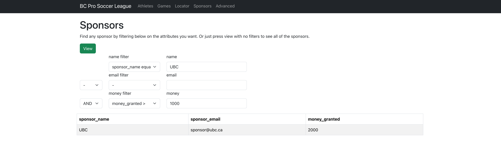

# Soccer Management System

## Summary

The focus of our project will be a sports management system, particularly for Soccer (Football) which can track various entities and attributes throughout the league. We built a website that enables users to perform actions such as editing or deleting athletes, determining game statistics, or simply viewing the standings & past scores.

We showed team specific statistics such as coach experience, championship contender teams, standings for the league, and statistics for recent games. We implemented search options such as finding games by venue, determining sponsors filtered by their attributes and showing tables from the database given any number of attributes. 

## How to Run
This project uses [Oracle DB](https://www.npmjs.com/package/oracledb), [Express.js](https://www.npmjs.com/package/express), [React.js](https://www.npmjs.com/package/react), and [Node.js](https://nodejs.org/en).


Clone the project and create a ``.env`` file in ``/``. It should contain this:

```
ORACLE_USER=
ORACLE_PASS=

#Adjust the PORT if needed (e.g., if you encounter a "port already occupied" error)
PORT=65535

ORACLE_HOST=
ORACLE_PORT=
ORACLE_DBNAME=
```

Fill out the above details with your Oracle DB details. Now run ``/server/sql-scripts/init.sql`` in your Oracle DB instance. This will initialize the necessary tables needed for the application.

Now run this in one terminal

```
cd server
npm install
node server.js
```
and this in another
```
cd client
npm install
npm start
```

## Examples





